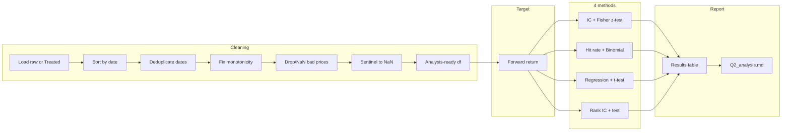

# Q2 Signal effectiveness: exhaustive plan

## Objective (Assignment 1, part 2)

Analyze the signal's effectiveness or lack thereof in forecasting the ETF price, using relevant metrics, and explain why those metrics were chosen. Keep it concise ("not a dissertation"). Correct for Q1 errors so we measure **true** predictability, not artifacts of bad data.

## High-level flow

---

## 1. Data cleaning (apply Q1 corrections)

**Goal:** Produce a single "analysis-ready" DataFrame (and optionally save to [HW1/results/analysis_ready.csv](HW1/results/analysis_ready.csv)) without modifying the raw CSV. All corrections are applied in code and documented.

**Steps (order matters):**

1. **Load**
  Use [HW1/src/io.py](HW1/src/io.py) `load_data` + `normalize_columns` on the raw WKKWNT CSV (or read [HW1/Treated_datasample.csv](HW1/Treated_datasample.csv) if OHLC flags are needed). Prefer raw + normalize so we control all steps.
2. **Sort by date**
  `df = df.sort_values("date").reset_index(drop=True)` so that "next day" is well-defined and the misplaced 2020 row is in correct chronological position.
3. **Deduplicate dates** (per [Q1_analysis.md](HW1/md_files/Q1_analysis.md) and duplicate-content audit):
  - **2016-08-19, 2016-11-03:** Keep first occurrence, drop second.
  - **2016-10-31:** Conflicting content; keep first and add a `flag_vendor_conflict` column for that date, or drop both rows. Plan: **keep first** for a conservative sample; document in report that 2016-10-31 is flagged.
4. **Fix monotonicity**
  Row 404 in the *original* file has date 2017-06-21 after 2020-06-20. After sorting, the 2020-06-20 row will sit with other 2020 data. If there is a duplicate 2017-06-21 that is clearly out of order (e.g. same date appears twice in different years), drop the one that breaks chronology. Implementation: after sort, detect any remaining backward step (date[t] < date[t-1]) and drop the *later* index (the one that is "in the past"). This removes the single mis-placed row.
5. **Bad prices**
  Rows where `adj_close <= 0` (2018-06-06, 2018-10-10): **drop** those rows so they do not contribute to returns. Optionally set their `adj_close` to NaN and then drop any row with NaN in `adj_close` when building returns. Result: no infinite or nonsensical returns.
6. **Signal sentinels**
  Replace signal in {-999, 0} with NaN (or drop those rows for signal-based methods). Plan: **replace with NaN** so we keep the same number of return observations where possible; for IC/regression/hit rate we will dropna on (signal, forward_return) so sentinel rows are excluded from the correlation/regression.
7. **Optional — OHLC / weekend**
  For a "strict" robustness run, optionally drop rows with `high_lt_low` or `close_not_in_low_high` True if using Treated_datasample; or drop weekend dates. Plan: **main results on "standard" cleaned sample** (steps 1–6); optional note in report that excluding OHLC-violation rows can be done for sensitivity.

**Output:** Analysis-ready DataFrame: columns `date`, `signal`, `open`, `high`, `low`, `price`, `adj_close`, and optionally `forward_return` (computed in next step). Save to `results/analysis_ready.csv` for traceability.

**Implementation:** New module [HW1/src/clean_for_analysis.py](HW1/src/clean_for_analysis.py) with a single entry point, e.g. `build_analysis_ready_df(raw_df_or_path) -> pd.DataFrame`, that performs steps 1–6 and returns the cleaned DataFrame. It should not mutate the raw file.

---

## 2. Target: forward return (point-in-time)

**Definition:**  
`forward_return[t] = (adj_close[t+1] / adj_close[t]) - 1`  
so that the signal at date `t` is used to predict the return from `t` to `t+1` (no lookahead).

**Rules:**  

- Compute only when both `adj_close[t]` and `adj_close[t+1]` are valid (no NaN, no zero/negative).  
- Last row has no forward return (NaN).  
- Add column `forward_return` to the analysis-ready DataFrame after cleaning.

**Implementation:** In `clean_for_analysis` or in a small helper in a new metrics module: after dropping bad-price rows, `df["forward_return"] = df["adj_close"].pct_change().shift(-1)`.

---

## 3. Four methods and hypothesis tests

### Method 1: Information Coefficient (Pearson) + test

- **Metric:** IC = Pearson correlation(signal, forward_return), computed on rows with non-NaN signal and forward_return.
- **Why:** Standard measure of linear predictive relationship; easy to interpret for PM.
- **Null hypothesis:** H0: ρ = 0 (no linear relationship).
- **Test:** Fisher z-transform: z = 0.5 * ln((1+r)/(1-r)), SE = 1/sqrt(n-3). Under H0, z/SE ~ N(0,1). Report two-sided p-value and 95% CI for ρ (transform back from z CI).
- **Output:** IC, n, z-stat, p-value, 95% CI for ρ.

### Method 2: Hit rate (directional accuracy) + test

- **Metric:** Hit rate = proportion of rows where sign(signal) == sign(forward_return). Exclude rows where signal is 0 or NaN.
- **Why:** Direct answer to "does the signal get direction right more often than not?"
- **Null hypothesis:** H0: p = 0.5 (random direction).
- **Test:** Binomial test (two-sided): number of successes = number of hits, n = number of valid pairs, p0 = 0.5. Report hit rate, n, p-value, 95% CI for p (e.g. Wilson or Clopper–Pearson).
- **Output:** Hit rate, n, p-value, 95% CI.

### Method 3: Linear regression + t-test

- **Metric:** OLS: forward_return = α + β * signal. Report β (slope), R², and significance of β.
- **Why:** Gives a direct "effect size" (how much return per unit signal) and uses standard inference.
- **Null hypothesis:** H0: β = 0.
- **Test:** t-test for slope from OLS (e.g. `scipy.stats` or `statsmodels`). Report β, SE(β), t-stat, p-value, 95% CI for β.
- **Output:** β, SE, t-stat, p-value, R², 95% CI for β.

### Method 4: Rank IC (Spearman) + test

- **Metric:** Rank IC = Spearman correlation(signal, forward_return).
- **Why:** Robust to outliers and non-linear monotone relationship; complements Pearson IC.
- **Null hypothesis:** H0: ρ_s = 0.
- **Test:** Either (a) Fisher z on rank correlation with n-3 SE, or (b) permutation test (shuffle forward_return, compute Spearman, repeat; p = proportion of |r_perm| >= |r_obs|). Plan: **Fisher z** for speed; document that permutation is an option for small n.
- **Output:** Rank IC, n, p-value, 95% CI for ρ_s.

**Implementation:** New module [HW1/src/metrics_signal.py](HW1/src/metrics_signal.py) (or split into `src/ic_test.py`, `src/hit_rate_test.py`, etc.) with functions such as:

- `compute_ic(signal, forward_return) -> (ic, n, p_value, ci_low, ci_high)`
- `compute_hit_rate(signal, forward_return) -> (hit_rate, n, p_value, ci_low, ci_high)`
- `compute_regression(signal, forward_return) -> (beta, se, t_stat, p_value, r_squared, ci_low, ci_high)`
- `compute_rank_ic(signal, forward_return) -> (rank_ic, n, p_value, ci_low, ci_high)`

Use `scipy.stats` for correlations, binomial test, and (if desired) OLS t-test; or `statsmodels.api.OLS` for regression. All functions should dropna on the two inputs and report n used.

---

## 4. Runner script and report

**Script:** [HW1/scripts/02_signal_effectiveness.py](HW1/scripts/02_signal_effectiveness.py)

- Load raw data (path from config or default to WKKWNT CSV).
- Call `build_analysis_ready_df` to get cleaned DataFrame.
- Compute forward return on the cleaned df.
- Call the four metric functions on (signal, forward_return).
- Print a **results table** to the terminal (Method | Metric | Estimate | Statistic | p-value | 95% CI).
- Save the same table to [HW1/results/q2_metrics.csv](HW1/results/q2_metrics.csv) (or a small summary CSV).
- Optionally write or append to [HW1/md_files/Q2_analysis.md](HW1/md_files/Q2_analysis.md): (1) short description of cleaning applied; (2) definition of forward return; (3) why each metric was chosen; (4) table of results; (5) 1–2 paragraph conclusion on true predictability (e.g. "After correcting for data errors, the signal shows/has no significant predictive power: IC and Rank IC are small and p > 0.05; hit rate is not significantly different from 50%; regression slope is not significant. Therefore we conclude ...").

**Dependencies:** Existing [HW1/src/io.py](HW1/src/io.py); new `clean_for_analysis.py`; new `metrics_signal.py`; `scipy.stats`; optionally `statsmodels` or `sklearn.linear_model` for regression. No new notebooks; all in Python scripts under `scripts/` and `src/`.

---

## 5. File and directory layout

- [HW1/src/clean_for_analysis.py](HW1/src/clean_for_analysis.py) — build analysis-ready DataFrame from raw (or Treated) data.
- [HW1/src/metrics_signal.py](HW1/src/metrics_signal.py) — IC, hit rate, regression, rank IC with hypothesis tests and CIs.
- [HW1/scripts/02_signal_effectiveness.py](HW1/scripts/02_signal_effectiveness.py) — run cleaning, compute metrics, print table, save CSV and optionally Q2_analysis.md.
- [HW1/results/analysis_ready.csv](HW1/results/analysis_ready.csv) — (optional) saved cleaned data.
- [HW1/results/q2_metrics.csv](HW1/results/q2_metrics.csv) — summary table of the 4 methods.
- [HW1/md_files/Q2_analysis.md](HW1/md_files/Q2_analysis.md) — short write-up: metrics chosen, results, conclusion on true predictability.

---

## 6. Why these metrics (for the write-up)

- **IC (Pearson):** Measures linear predictive relationship between signal and next-period return; industry standard; interpretable (e.g. IC ≈ 0.05 is often considered meaningful).
- **Hit rate:** Answers "Does the signal get direction right more often than not?"; easy for PM to understand; binomial test gives a clear yes/no on significance vs. 50%.
- **Linear regression:** Provides slope (return per unit signal) and standard inference (t-test on β); complements IC by giving a direct effect size.
- **Rank IC (Spearman):** Robust to outliers and non-linear monotone relationships; guards against a single bad tick driving the result.

All four use an explicit null hypothesis (no predictability) and a corresponding test so we can state whether any apparent predictability is statistically distinguishable from zero after correcting for errors.

---

## 7. Implementation order

1. Implement `clean_for_analysis.py` (load, sort, dedup, fix monotonicity, drop bad prices, sentinel → NaN; return df; optional save to `results/analysis_ready.csv`).
2. Add forward return computation (in cleaner or in runner).
3. Implement `metrics_signal.py` (IC + Fisher z, hit rate + binomial, OLS + t-test, rank IC + Fisher z).
4. Implement `02_signal_effectiveness.py` (wire path, clean, metrics, table, CSV, optional Q2_analysis.md).
5. Write or auto-generate the narrative parts of `Q2_analysis.md` (why these metrics; conclusion on true predictability).

This plan corrects for Q1 errors, defines the target clearly, uses four methods with hypothesis tests, and produces a concise report suitable for Assignment 1 part 2 and for the extra-credit PM summary (part 3).