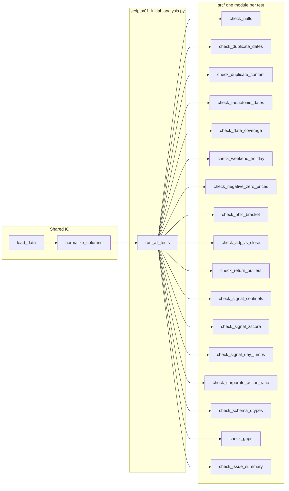

# Modular initial data analysis (15+ tests)

## Current state

- **HW1** contains only [HW1/Assignment1.txt](HW1/Assignment1.txt) and [HW1/WKKWNT Data Sample (HomeWork #1 15-439).csv](HW1/WKKWNT%20Data%20Sample%20(HomeWork%20%231%2015-439).csv).
- Data: 7 columns — `Date`, `Signal`, `Open`, `High`, `Low`, `Close`, `Adj Close`; ~1047 rows.
- No existing `src/` or `scripts/`; venv exists at project root.

## Architecture




## 1. Shared data loading

**File:** [HW1/src/io.py](HW1/src/io.py)

- `**load_data(path)**`: Detect by extension; if `.csv` use `pd.read_csv`, if `.xlsx` use `pd.read_excel(engine="openpyxl")`. Parse `Date` as datetime. Return `pd.DataFrame`.
- `**normalize_columns(df)**`: Map `Date` → `date`, `Signal` → `signal`, `Close` → `price`, keep `Open`, `High`, `Low`, `Adj Close` as-is (or lowercase). Return DataFrame with consistent column names used by all checks.
- `**DATA_DIR` / default path**: Default to `HW1/` so the runner can pass `Path(__file__).resolve().parent.parent / "WKKWNT Data Sample (HomeWork #1 15-439).csv"` or a configurable path.

All test modules receive the **normalized** DataFrame (and optionally `results_dir`, `figures_dir`).

---

## 2. Contract for each test module

Each file under `src/`:

- Exposes `**run(df: pd.DataFrame, results_dir: Path, figures_dir: Path) -> None**`.
- Prints a **clear section header** (e.g. `"=== 1. Null counts ==="`) and then results (tables, counts, or short lists) to **terminal**.
- **Optionally** saves one or more plots under `figures_dir` with descriptive names (e.g. `null_counts.png`). Use non-interactive backend (`matplotlib.use("Agg")`) and `plt.savefig(..., bbox_inches="tight")`; no `plt.show()` in script mode.
- Can be run standalone: `if __name__ == "__main__": run(load_and_normalize(default_path), ...)`.
- No in-place modification of `df`; work on copies if needed.

---

## 3. List of 17 tests (minimum 15)


| #   | Module                         | Description                                                                                    | Terminal output                                                    | Plot (if any)                                         |
| --- | ------------------------------ | ---------------------------------------------------------------------------------------------- | ------------------------------------------------------------------ | ----------------------------------------------------- |
| 1   | `check_nulls`                  | Null count per column                                                                          | Table: column, null_count, pct                                     | Bar chart of null counts per column                   |
| 2   | `check_duplicate_dates`        | Duplicate calendar dates                                                                       | List of dates with duplicate count and row indices                 | Bar: duplicate count per date                         |
| 3   | `check_duplicate_content`      | For each duplicate date: compare OHLC + signal                                                 | Table: date, n_copies, identical (Y/N), recommendation             | —                                                     |
| 4   | `check_monotonic_dates`        | Dates must be non-decreasing                                                                   | Table: row_index, date, previous_date                              | —                                                     |
| 5   | `check_date_coverage`          | Business-day calendar vs observed; missing sessions                                            | Missing count by year; sample of missing dates                     | Bar: missing sessions per year                        |
| 6   | `check_weekend_holiday`        | Flag weekend (Sat/Sun) in date series                                                          | Count and list of weekend dates                                    | —                                                     |
| 7   | `check_negative_zero_prices`   | Price (Adj Close or Close) <= 0                                                                | Table: row_index, date, price                                      | Time series of price with anomaly points highlighted  |
| 8   | `check_ohlc_bracket`           | Low <= Adj Close <= High, High >= Low                                                          | Table of violations: row_index, date, check type                   | —                                                     |
| 9   | `check_adj_vs_close`           | Adj Close vs Close (mismatch)                                                                  | Count and table of rows where Adj Close != Close (above tolerance) | Scatter Adj Close vs Close with identity line         |
| 10  | `check_return_outliers`        | Single-period return                                                                           | r                                                                  | > threshold (e.g. 20%)                                |
| 11  | `check_signal_sentinels`       | Sentinel values: -999, runs of zeros                                                           | Count of -999 and zero runs; list dates                            | Optional: signal timeline with sentinel points marked |
| 12  | `check_signal_zscore`          | Signal z-score; flag                                                                           | z                                                                  | > 5                                                   |
| 13  | `check_signal_day_jumps`       | Day-over-day signal change > K sigma                                                           | Table: row_index, date, change, sigma                              | —                                                     |
| 14  | `check_corporate_action_ratio` | Adj Close / Close ratio; abrupt % change                                                       | Table of dates with ratio change > threshold                       | Time series of ratio                                  |
| 15  | `check_schema_dtypes`          | Dtypes per column                                                                              | Print dtypes; save `schema_snapshot.csv` under results_dir         | —                                                     |
| 16  | `check_gaps`                   | Consecutive date gaps > N calendar days                                                        | Table: gap_start, gap_end, gap_days                                | Bar or histogram of gap lengths                       |
| 17  | `check_issue_summary`          | Summary counts of all issue types (depends on other checks exporting or re-running key checks) | One table: check_name, count                                       | Optional: horizontal bar of issue counts              |


**Note:** For (17), the runner can either re-invoke the same checks and aggregate counts, or each check can append a single-row summary to a shared list/dict that the runner passes. Simplest: `check_issue_summary` receives no prior state and re-runs a minimal set of checks (nulls, duplicates, monotonic, negative price, return outlier, signal sentinel) to produce a single summary table and optional bar plot.

---

## 4. Directory layout

```
HW1/
  src/
    __init__.py
    io.py
    check_nulls.py
    check_duplicate_dates.py
    check_duplicate_content.py
    check_monotonic_dates.py
    check_date_coverage.py
    check_weekend_holiday.py
    check_negative_zero_prices.py
    check_ohlc_bracket.py
    check_adj_vs_close.py
    check_return_outliers.py
    check_signal_sentinels.py
    check_signal_zscore.py
    check_signal_day_jumps.py
    check_corporate_action_ratio.py
    check_schema_dtypes.py
    check_gaps.py
    check_issue_summary.py
  scripts/
    01_initial_analysis.py
  results/
    figures/   (created by runner; all plots saved here)
  WKKWNT Data Sample (HomeWork #1 15-439).csv
  Assignment1.txt
```

---

## 5. Runner script

**File:** [HW1/scripts/01_initial_analysis.py](HW1/scripts/01_initial_analysis.py)

- **Paths**: `SCRIPT_DIR = Path(__file__).resolve().parent`, `HW1_DIR = SCRIPT_DIR.parent`. Data path: `HW1_DIR / "WKKWNT Data Sample (HomeWork #1 15-439).csv"` (or optional CLI arg). `results_dir = HW1_DIR / "results"`, `figures_dir = results_dir / "figures"`; create dirs if missing.
- **Load once**: `from src.io import load_data, normalize_columns`; `df = normalize_columns(load_data(data_path))`.
- **Sys.path**: `sys.path.insert(0, str(HW1_DIR))` so `from src.check_* import run` works.
- **Run each test** in a fixed order (1..17). For each: print a divider, call `run(df, results_dir, figures_dir)`, catch exceptions and log "Check X failed: ..." so one failure does not stop the rest.
- **Matplotlib**: Set `matplotlib.use("Agg")` and optionally `MPLCONFIGDIR` to a writable dir (e.g. `HW1_DIR / ".mpl_cache"`) at the top of the script to avoid font/cache warnings.

---

## 6. Implementation order

1. **io.py** — load_data (CSV + xlsx), normalize_columns.
2. **check_nulls** through **check_schema_dtypes** (15 modules) — each implements `run(...)`, terminal + optional plot.
3. **check_gaps**, **check_issue_summary** (16–17).
4. **01_initial_analysis.py** — wire data path, results/figures dirs, import and run all 17 checks with try/except.

---

## 7. Plotting conventions

- Figure size and style: e.g. `plt.figure(figsize=(10, 5))`, `plt.title("...")`, `plt.xlabel`, `plt.ylabel`.
- Save: `figures_dir / "short_snake_case_name.png"` at 150 dpi, `bbox_inches="tight"`.
- Close figure after save to avoid memory buildup: `plt.close()`.

---

## 8. Data column assumptions (normalized)

After `normalize_columns`:

- `date`: datetime.
- `signal`: float (Signal).
- `Open`, `High`, `Low`: float.
- `price`: float (Close).
- `Adj Close`: float.

Use `date` for time ordering; use `price` or `Adj Close` consistently (e.g. returns from `Adj Close` for corporate-action consistency; bracket check uses `Low`, `High`, `Adj Close`).

This plan yields **17 tests**, each in its own file under `src/`, with terminal output and optional clear plots, and a single entry point `scripts/01_initial_analysis.py` that runs them all.